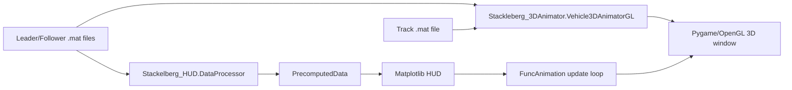

# Architecture

## Current Entry Points

- `Stackelberg_Main.py`: integrated runner. It creates a Matplotlib HUD window,
  creates a placeholder axes in the centre, then opens a second borderless
  Pygame/OpenGL window for the 3D scene.
- `Stackleberg_3DAnimator.py`: standalone Pygame/OpenGL renderer.
- `Stackelberg_HUD.py`: MATLAB data loading, telemetry calculation, Matplotlib
  HUD widgets, and precomputed 2D animation data.
- `VideoWriter.py`: headless/export path. It duplicates substantial logic from
  the integrated runner, but its duplicate data-processing call and duplicate
  exception handler have been removed.

## Current Data Flow



The duplicated loading is the central design smell. Both `DataProcessor` and
`Vehicle3DAnimatorGL` read the MATLAB files and compute positions independently.
They do not share a typed trajectory object. The coordinate maths has been
factored into `animator_math.py`, but the file loading and playback assembly
still happen in two places.

## Why The Pygame Window Does Not Render Inside The HUD

The centre of the Matplotlib dashboard is only a placeholder axes:

- `Stackelberg_Main.py` defines `animation_pos` and `animation_size` for a
  Matplotlib axes.
- `_setup_animation_area()` draws a black panel and text there.
- `_init_pygame()` then creates an entirely separate Pygame window using
  `pygame.display.set_mode(..., pygame.NOFRAME)`.
- The code now tries to set `SDL_VIDEO_WINDOW_POS` from the realised pixel
  rectangle of the Matplotlib axes. If that fails, it falls back to the old
  layout ratios.

So the Pygame scene is not a child widget of the HUD. It is a second top-level
window that happens to be borderless and positioned over the centre panel.

This is fragile because the location depends on:

- Matplotlib backend behaviour.
- Window-manager decorations and maximisation.
- Wayland versus X11.
- Display scaling.
- Multiple monitors.
- Whether the Matplotlib window has actually been realised before Pygame is
  positioned.
- DPI differences between Matplotlib figure units and physical screen pixels.

## Broad Architecture Changes Needed

### 1. Split Model, View, And Application State

Create a small package structure instead of three large scripts:

```text
phd_3d_animator/
  data/
    loaders.py
    trajectory.py
    track.py
  math/
    frames.py
    tyre_forces.py
    monge_surface.py
  render/
    opengl_scene.py
    hud.py
  app/
    main_window.py
    playback.py
```

The data layer should load each `.mat` file once and produce explicit objects:

- `TrackSurface`: centreline, width, Monge coefficients, coordinate transforms,
  surface normal, and tangent/lateral basis.
- `VehicleTrajectory`: state arrays in physical units.
- `RaceData`: leader/follower trajectories resampled to one playback timeline.

### 2. Use One Windowing Framework

The clean fix is to stop mixing a Matplotlib top-level window with a separate
Pygame top-level window.

Recommended route:

- Use PySide6/PyQt6 as the application shell.
- Put the 3D scene in a `QOpenGLWidget`.
- Put HUD plots in Qt widgets, a Matplotlib `FigureCanvasQTAgg`, or pyqtgraph.
- Drive everything from one timer and one playback state.

Alternative route:

- Make Pygame the only window.
- Render the HUD in Pygame/OpenGL, possibly with ImGui or a lightweight UI
  overlay.

The Qt route is better for research tooling because it gives native docking,
menus, file dialogs, resizing, and robust widget layout. The Pygame-only route
is simpler if the goal is just a robust animation/video viewer.

### 3. Isolate Coordinate Frames

Previously the 3D renderer flipped `y` and `z` internally:

```python
yMesh = -yMesh
zMesh = -zMesh * self.z_scale
```

That display choice now lives in explicit helpers:

```python
model_to_display_points(...)
display_to_model_points(...)
display_pose_from_model_pose(...)
```

Every renderer, camera, trail, and car transform should continue to consume
display-space data produced by the same frame module. No renderer should
silently reintroduce axis flips.

### 4. Use A Surface-Oriented Vehicle Pose

The car pose should be built from a proper orthonormal frame:

- longitudinal axis from the vehicle heading projected onto the Monge tangent
  plane;
- lateral axis on the surface;
- normal axis from the Monge surface normal;
- optional body pitch/roll only if the dynamic model provides it or if it can be
  consistently inferred.

The 3D code now builds a pose matrix from the vehicle heading projected onto the
Monge tangent plane and the local surface normal. It is a better visual pose
than yaw-plus-bank, but it is still not a full reconstruction of every body-rate
quantity in the MATLAB dynamics.

### 5. Add A Testable Validation Layer

The first headless regression tests now compare Python-derived values against
MATLAB-derived formulas and fixture data:

- state unscaling;
- `s,n -> x,y,z` conversion;
- surface normal and bank/camber angle;
- slip angles;
- tyre forces;
- resampling onto playback time;
- coordinate-frame conversion into display space;
- renderer/HUD common-timeline coordinate agreement;
- orthonormal display pose matrices.

These tests should run headlessly and should not require a display server.

## Short-Term Fix If Keeping The Current Architecture

The current code implements the first part of this fallback:

- Create the Matplotlib window and force a draw.
- Query the actual pixel bounds of `animation_ax` with
  `animation_ax.get_window_extent()`.
- Convert canvas coordinates to physical screen coordinates for Tk/Qt-like
  backends when possible.
- Position the Pygame window from that rectangle.

Still needed:

- Reposition/resize Pygame when the Matplotlib window moves or resizes.
- Make detached-window mode explicit when reliable placement is not possible.

This would reduce the annoyance, but it will remain fragile compared with a
single real GUI window.
